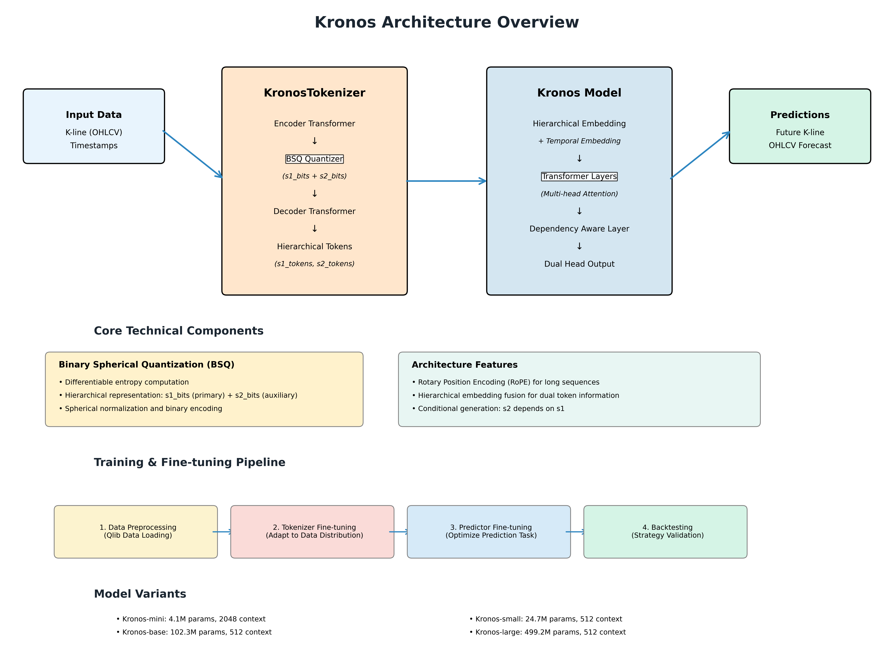

# Kronos 代码架构分析

## 概述

Kronos 是一个专门为金融市场 K 线数据设计的开源基础模型，采用独特的两阶段框架来处理连续的、高噪声的金融时间序列数据。

## 整体架构



### 目录结构
```
Kronos/
├── model/              # 核心模型实现
│   ├── __init__.py    # 模型导出接口
│   ├── kronos.py      # 主要模型类
│   └── module.py      # 核心组件和工具模块
├── finetune/          # 微调训练脚本
│   ├── config.py      # 配置管理
│   ├── dataset.py     # 数据集处理
│   ├── train_*.py     # 训练脚本
│   └── utils/         # 训练工具
├── examples/          # 使用示例
│   ├── data/          # 示例数据
│   └── prediction_*.py # 预测示例
├── webui/             # Web 界面
│   ├── app.py         # Flask 应用
│   ├── templates/     # 模板文件
│   └── prediction_results/ # 预测结果
└── figures/           # 文档图片
```

## 核心架构设计

### 两阶段框架

Kronos 采用创新的两阶段架构：

1. **第一阶段：专用分词器 (KronosTokenizer)**
   - 将连续的多维 K 线数据 (OHLCV) 量化为分层离散 token
   - 使用二进制球面量化 (Binary Spherical Quantization, BSQ)

2. **第二阶段：自回归 Transformer (Kronos)**
   - 在量化后的 token 上进行预训练
   - 支持多种下游量化任务

### 核心组件详解

#### 1. KronosTokenizer (分词器)

**位置**: `model/kronos.py:13-179`

**主要特性**:
- **编码器-解码器架构**: 使用 Transformer 编码器和解码器
- **BSQ 量化**: 创新的二进制球面量化方法
- **分层表示**: 支持 s1_bits 和 s2_bits 的分层量化

**关键方法**:
```python
def forward(self, x):
    # 编码 -> 量化 -> 解码
    return (z_pre, z), bsq_loss, quantized, z_indices

def encode(self, x, half=False):
    # 将输入数据编码为量化索引
    
def decode(self, z_indices, half=False):
    # 从量化索引解码回原始数据
```

#### 2. Kronos (主预测模型)

**位置**: `model/kronos.py:181-377`

**架构特点**:
- **分层嵌入**: `HierarchicalEmbedding` 处理双重 token
- **时间嵌入**: `TemporalEmbedding` 处理时间特征
- **依赖感知层**: `DependencyAwareLayer` 建模 token 间依赖
- **双重输出头**: `DualHead` 分别预测 s1 和 s2 token

**核心流程**:
```python
def forward(self, s1_ids, s2_ids, stamp=None, padding_mask=None):
    # 1. 分层嵌入
    x = self.embedding([s1_ids, s2_ids])
    # 2. 时间嵌入
    if stamp is not None:
        x = x + self.time_emb(stamp)
    # 3. Transformer 层
    for layer in self.transformer:
        x = layer(x, key_padding_mask=padding_mask)
    # 4. 双重预测头
    s1_logits = self.head(x)
    s2_logits = self.head.cond_forward(x2)
```

#### 3. KronosPredictor (预测接口)

**位置**: `model/kronos.py:456-626`

**功能**:
- **高级预测接口**: 封装数据预处理、预测和后处理
- **批量预测**: 支持多个时间序列的并行预测
- **采样控制**: 支持温度、top-p、top-k 等采样策略

## 核心技术组件

### 1. 二进制球面量化器 (BSQuantizer)

**位置**: `model/module.py:222-252`

**创新点**:
- 使用二进制表示进行球面量化
- 支持分层量化 (s1_bits + s2_bits)
- 可微分的熵计算

### 2. 分层嵌入系统 (HierarchicalEmbedding)

**位置**: `model/module.py:424-453`

**设计理念**:
- **双重 token 系统**: s1 (主要) 和 s2 (辅助) token
- **融合机制**: 通过线性层融合两种嵌入
- **可扩展性**: 支持不同的 bit 配置

### 3. 依赖感知层 (DependencyAwareLayer)

**位置**: `model/module.py:455-472`

**功能**:
- 建模 s1 和 s2 token 之间的条件依赖
- 使用交叉注意力机制
- 支持掩码处理

### 4. 旋转位置编码 (RoPE)

**位置**: `model/module.py:281-337`

**优势**:
- 相对位置编码
- 更好的长序列处理能力
- 支持动态序列长度

## 模型配置和变体

### 可用模型

| 模型 | 分词器 | 上下文长度 | 参数量 | 开源状态 |
|------|--------|------------|--------|----------|
| Kronos-mini | Kronos-Tokenizer-2k | 2048 | 4.1M | ✅ |
| Kronos-small | Kronos-Tokenizer-base | 512 | 24.7M | ✅ |
| Kronos-base | Kronos-Tokenizer-base | 512 | 102.3M | ✅ |
| Kronos-large | Kronos-Tokenizer-base | 512 | 499.2M | ❌ |

## 训练和微调流程

### 微调配置 (finetune/config.py)

**关键参数**:
- **数据参数**: `lookback_window=90`, `predict_window=10`
- **训练参数**: `epochs=30`, `batch_size=50`
- **学习率**: tokenizer (2e-4), predictor (4e-5)
- **量化参数**: `clip=5.0` (数据归一化裁剪)

### 训练流程

1. **数据预处理** (`qlib_data_preprocess.py`)
   - 从 Qlib 加载市场数据
   - 创建滑动窗口样本
   - 分割训练/验证/测试集

2. **分词器微调** (`train_tokenizer.py`)
   - 调整分词器适应特定数据分布
   - 支持多GPU训练

3. **预测器微调** (`train_predictor.py`)
   - 微调主要的 Kronos 模型
   - 针对预测任务优化

4. **回测评估** (`qlib_test.py`)
   - 生成预测信号
   - 运行量化策略回测

## Web 界面架构

### Flask 应用 (webui/app.py)

**功能模块**:
- **模型管理**: 动态加载不同的 Kronos 变体
- **实时预测**: 支持用户上传数据进行预测
- **可视化**: 使用 Plotly 生成交互式图表
- **结果存储**: 预测结果自动保存为 JSON

## 使用示例

### 基本预测流程

```python
from model import Kronos, KronosTokenizer, KronosPredictor

# 1. 加载模型和分词器
tokenizer = KronosTokenizer.from_pretrained("NeoQuasar/Kronos-Tokenizer-base")
model = Kronos.from_pretrained("NeoQuasar/Kronos-small")

# 2. 创建预测器
predictor = KronosPredictor(model, tokenizer, device="cuda:0", max_context=512)

# 3. 准备数据
x_df = df[['open', 'high', 'low', 'close', 'volume', 'amount']]
x_timestamp = df['timestamps']
y_timestamp = future_timestamps

# 4. 生成预测
pred_df = predictor.predict(
    df=x_df,
    x_timestamp=x_timestamp,
    y_timestamp=y_timestamp,
    pred_len=120,
    T=1.0,
    top_p=0.9,
    sample_count=1
)
```

## 技术特色和创新点

### 1. 专门化设计
- **金融领域特化**: 专门为 K 线数据设计，而非通用时序模型
- **高噪声处理**: 针对金融数据的高噪声特性优化

### 2. 分层量化
- **多尺度表示**: s1/s2 双重 token 系统
- **可控精度**: 通过 bit 配置控制量化精度

### 3. 条件生成
- **依赖建模**: s2 token 条件依赖于 s1 token
- **教师强制**: 训练时支持教师强制机制

### 4. 灵活的推理
- **多样化采样**: 支持多种采样策略
- **批量处理**: 高效的批量预测能力

## 扩展性和定制化

### 1. 模型扩展
- **新的量化方法**: 可替换 BSQ 量化器
- **不同的架构**: 可调整 Transformer 层数和维度

### 2. 数据适配
- **多种数据源**: 支持不同格式的金融数据
- **特征工程**: 灵活的时间特征提取

### 3. 训练定制
- **损失函数**: 可自定义训练损失
- **正则化**: 支持多种正则化技术

## 总结

Kronos 架构通过以下关键设计实现了对金融时序数据的有效建模：

1. **两阶段框架**: 分离量化和预测任务，提高模型效率
2. **分层表示**: 多尺度 token 系统捕获不同层次的信息
3. **专门化组件**: 针对金融数据特点设计的各种模块
4. **端到端流程**: 从数据预处理到模型部署的完整解决方案

这种架构设计使得 Kronos 能够有效处理金融市场的复杂性和不确定性，为量化交易和金融分析提供强大的基础模型支持。