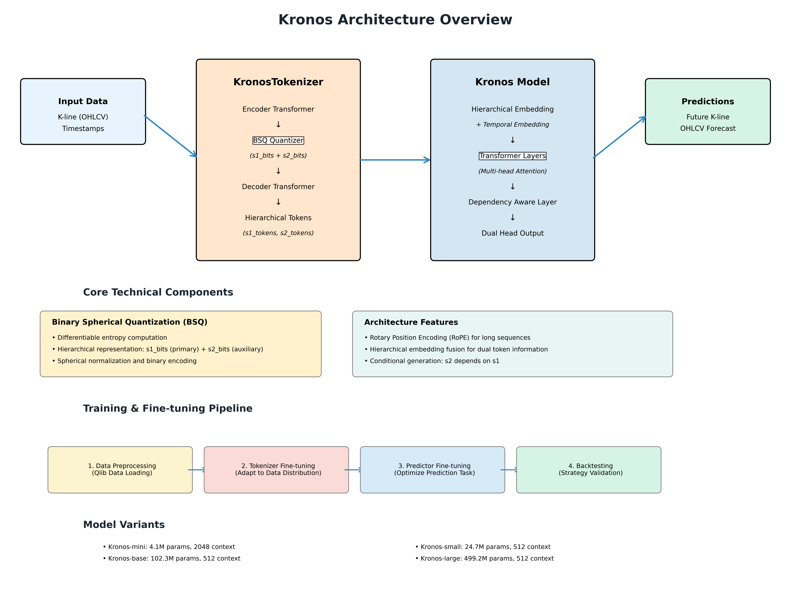

# Kronos Code Architecture Analysis

## Executive Summary

Kronos is an innovative open-source foundation model specifically designed for financial market candlestick (K-line) data, representing the first model of its kind to handle the complex, high-noise characteristics of financial time series. The architecture employs a novel two-stage framework that separates tokenization and prediction tasks for optimal performance.

## Architecture Overview

### Two-Stage Framework

The Kronos architecture is built on a revolutionary two-stage approach:

1. **Stage 1: Specialized Tokenizer (KronosTokenizer)**
   - Quantizes continuous multi-dimensional K-line data (OHLCV) into hierarchical discrete tokens
   - Uses Binary Spherical Quantization (BSQ) for efficient data compression

2. **Stage 2: Autoregressive Transformer (Kronos)**
   - Large Transformer model pre-trained on quantized tokens
   - Serves as a unified foundation for diverse quantitative tasks



## Core Components Analysis

### 1. KronosTokenizer - Advanced Financial Data Tokenizer

**Location**: `model/kronos.py:13-179`

**Architecture Details**:
- **Encoder-Decoder Structure**: Utilizes Transformer encoder and decoder blocks
- **BSQ Integration**: Implements Binary Spherical Quantization for hierarchical token generation
- **Dual-bit System**: Supports s1_bits (primary) and s2_bits (auxiliary) for multi-scale representation

**Key Methods**:
```python
def forward(self, x):
    # Encode -> Quantize -> Decode pipeline
    z = self.embed(x)
    for layer in self.encoder: z = layer(z)
    z = self.quant_embed(z)
    bsq_loss, quantized, z_indices = self.tokenizer(z)
    # Dual decoding for s1 and s2 representations
    return (z_pre, z), bsq_loss, quantized, z_indices
```

**Innovation Points**:
- **Hierarchical Quantization**: Separates information into primary (s1) and auxiliary (s2) channels
- **Differentiable Quantization**: BSQ allows end-to-end training
- **Financial Domain Adaptation**: Specifically designed for OHLCV data characteristics

### 2. Kronos Model - Conditional Autoregressive Predictor

**Location**: `model/kronos.py:181-377`

**Architectural Components**:

#### Hierarchical Embedding System
```python
class HierarchicalEmbedding(nn.Module):
    def __init__(self, s1_bits, s2_bits, d_model=256):
        self.emb_s1 = nn.Embedding(2**s1_bits, d_model)
        self.emb_s2 = nn.Embedding(2**s2_bits, d_model)
        self.fusion_proj = nn.Linear(d_model * 2, d_model)
```

#### Dependency-Aware Architecture
```python
def forward(self, s1_ids, s2_ids, stamp=None):
    # 1. Hierarchical embedding fusion
    x = self.embedding([s1_ids, s2_ids])
    # 2. Temporal embedding integration
    if stamp is not None:
        x = x + self.time_emb(stamp)
    # 3. Multi-layer Transformer processing
    for layer in self.transformer:
        x = layer(x, key_padding_mask=padding_mask)
    # 4. Conditional dual-head prediction
    s1_logits = self.head(x)
    s2_logits = self.head.cond_forward(dependency_aware_repr)
```

**Advanced Features**:
- **Conditional Generation**: s2 tokens are conditioned on s1 tokens
- **Teacher Forcing**: Supports both training and inference modes
- **Dynamic Context**: Handles variable-length sequences efficiently

### 3. KronosPredictor - High-Level Inference Interface

**Location**: `model/kronos.py:456-626`

**Capabilities**:
- **Unified Interface**: Handles preprocessing, prediction, and postprocessing
- **Batch Processing**: Efficient parallel prediction for multiple time series
- **Sampling Control**: Advanced sampling strategies (temperature, top-p, top-k)

**Key Features**:
```python
def predict(self, df, x_timestamp, y_timestamp, pred_len, 
           T=1.0, top_p=0.9, sample_count=1):
    # Automatic data normalization and preprocessing
    # Autoregressive token generation
    # Inverse normalization and output formatting
```

## Technical Innovation Deep Dive

### Binary Spherical Quantization (BSQ)

**Location**: `model/module.py:222-252`

**Mathematical Foundation**:
- Spherical normalization: `z = F.normalize(z, dim=-1)`
- Binary representation with differentiable entropy
- Hierarchical bit allocation for multi-scale information capture

**Advantages**:
- **Differentiable**: Enables end-to-end gradient-based training
- **Efficient**: Compact binary representation reduces memory footprint
- **Hierarchical**: Multi-level quantization captures different information scales

### Rotary Position Encoding (RoPE)

**Location**: `model/module.py:281-337`

**Benefits for Financial Data**:
- **Relative Positioning**: Better handling of temporal relationships
- **Scalability**: Efficient processing of long sequences
- **Translation Invariance**: Robust to sequence length variations

**Implementation**:
```python
def forward(self, q, k):
    seq_len = q.shape[-2]
    cos, sin = self._update_cos_sin_cache(q, seq_len)
    return apply_rotary_pos_emb(q, k, cos, sin)
```

### Dependency-Aware Layer

**Location**: `model/module.py:455-472`

**Purpose**: Models conditional dependencies between s1 and s2 tokens using cross-attention:

```python
def forward(self, hidden_states, sibling_embed, key_padding_mask=None):
    attn_out = self.cross_attn(
        query=sibling_embed,
        key=hidden_states,
        value=hidden_states,
        key_padding_mask=key_padding_mask
    )
    return self.norm(hidden_states + attn_out)
```

## Model Variants and Configurations

| Model | Tokenizer | Context | Parameters | Status | Use Case |
|-------|-----------|---------|------------|--------|----------|
| Kronos-mini | Tokenizer-2k | 2048 | 4.1M | ✅ Open | Fast inference, resource-constrained |
| Kronos-small | Tokenizer-base | 512 | 24.7M | ✅ Open | Balanced performance |
| Kronos-base | Tokenizer-base | 512 | 102.3M | ✅ Open | High accuracy applications |
| Kronos-large | Tokenizer-base | 512 | 499.2M | ❌ Closed | Research and enterprise |

## Training and Fine-tuning Architecture

### Configuration Management

**File**: `finetune/config.py`

**Key Parameters**:
```python
class Config:
    # Data parameters
    lookback_window = 90      # Historical context
    predict_window = 10       # Forecast horizon
    max_context = 512         # Model context limit
    
    # Training hyperparameters
    tokenizer_learning_rate = 2e-4
    predictor_learning_rate = 4e-5
    batch_size = 50
    clip = 5.0               # Normalization clipping
```

### Multi-Stage Training Pipeline

1. **Data Preprocessing** (`qlib_data_preprocess.py`)
   - Qlib integration for Chinese A-share market data
   - Sliding window sample generation
   - Train/validation/test split with temporal considerations

2. **Tokenizer Fine-tuning** (`train_tokenizer.py`)
   - Domain adaptation for specific market characteristics
   - Multi-GPU distributed training support
   - BSQ parameter optimization

3. **Predictor Fine-tuning** (`train_predictor.py`)
   - Autoregressive prediction task optimization
   - Gradient accumulation for large effective batch sizes
   - Learning rate scheduling and early stopping

4. **Backtesting and Evaluation** (`qlib_test.py`)
   - Quantitative strategy simulation
   - Performance metrics calculation
   - Risk-adjusted return analysis

## Web Interface Architecture

### Flask Application Structure

**File**: `webui/app.py`

**Components**:
- **Model Management**: Dynamic loading of different Kronos variants
- **Real-time Prediction**: User data upload and processing
- **Visualization**: Interactive Plotly charts for results
- **Result Persistence**: JSON storage of prediction outcomes

**API Endpoints**:
```python
@app.route('/predict', methods=['POST'])
def predict():
    # Handle file upload
    # Model inference
    # Result visualization
    # JSON response
```

## Usage Patterns and Examples

### Basic Prediction Workflow

```python
# 1. Model initialization
tokenizer = KronosTokenizer.from_pretrained("NeoQuasar/Kronos-Tokenizer-base")
model = Kronos.from_pretrained("NeoQuasar/Kronos-small")
predictor = KronosPredictor(model, tokenizer, device="cuda:0")

# 2. Data preparation
df = pd.read_csv("financial_data.csv")
x_df = df[['open', 'high', 'low', 'close', 'volume', 'amount']]
x_timestamp = df['timestamps']
y_timestamp = future_timestamps

# 3. Prediction generation
predictions = predictor.predict(
    df=x_df,
    x_timestamp=x_timestamp,
    y_timestamp=y_timestamp,
    pred_len=120,
    T=1.0,           # Temperature for sampling
    top_p=0.9,       # Nucleus sampling
    sample_count=1   # Number of forecast paths
)
```

### Batch Processing for Multiple Assets

```python
# Efficient parallel processing
pred_results = predictor.predict_batch(
    df_list=[df1, df2, df3],
    x_timestamp_list=[ts1, ts2, ts3],
    y_timestamp_list=[future_ts1, future_ts2, future_ts3],
    pred_len=pred_len,
    verbose=True
)
```

## Advanced Features and Extensibility

### 1. Sampling Strategies
- **Temperature Control**: Adjusts prediction randomness
- **Top-p (Nucleus) Sampling**: Truncates probability mass
- **Top-k Sampling**: Limits to k most likely tokens
- **Multiple Samples**: Ensemble prediction through averaging

### 2. Context Management
- **Dynamic Context Window**: Adjusts to sequence length
- **Sliding Window**: Maintains recent context for long sequences
- **Memory Optimization**: Efficient GPU memory usage

### 3. Customization Points
- **Quantization Methods**: Replaceable BSQ implementation
- **Loss Functions**: Customizable training objectives
- **Data Adapters**: Flexible input format handling
- **Feature Engineering**: Extensible temporal feature extraction

## Performance Characteristics

### Computational Efficiency
- **Memory Usage**: Optimized for GPU memory constraints
- **Inference Speed**: Efficient autoregressive generation
- **Batch Processing**: Parallel prediction capabilities
- **Context Scaling**: Linear complexity with sequence length

### Prediction Quality
- **Multi-scale Modeling**: Captures both trend and noise
- **Temporal Consistency**: Maintains realistic price movements
- **Volatility Modeling**: Handles market regime changes
- **Risk Awareness**: Uncertainty quantification through sampling

## Summary of Architectural Strengths

1. **Domain Specialization**: Purpose-built for financial time series
2. **Hierarchical Design**: Multi-scale information processing
3. **Modular Architecture**: Separates concerns for maintainability
4. **Production Ready**: Complete inference and deployment pipeline
5. **Research Friendly**: Extensible for academic experimentation

## Future Enhancement Possibilities

1. **Multi-modal Integration**: Incorporate news and sentiment data
2. **Reinforcement Learning**: Portfolio optimization integration
3. **Federated Learning**: Privacy-preserving multi-institution training
4. **Real-time Streaming**: Live market data processing
5. **Cross-market Adaptation**: Transfer learning across different markets

This architecture represents a significant advancement in applying foundation models to financial markets, providing both theoretical innovation and practical utility for quantitative finance applications.